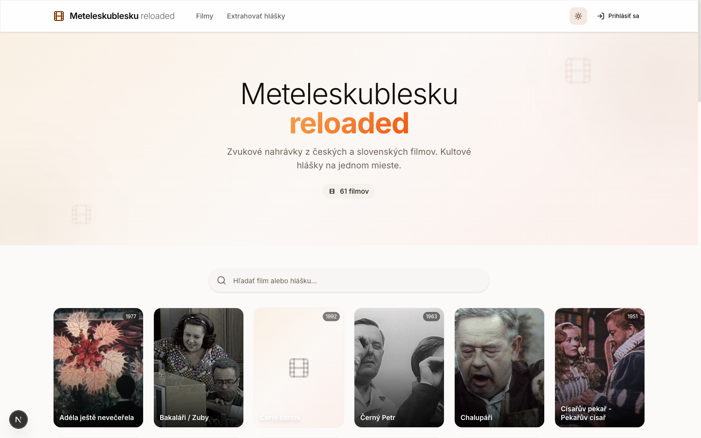
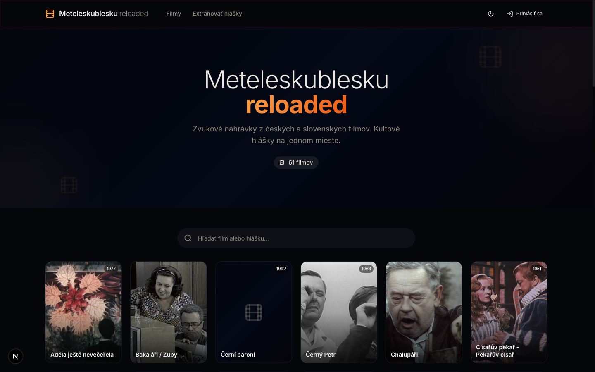
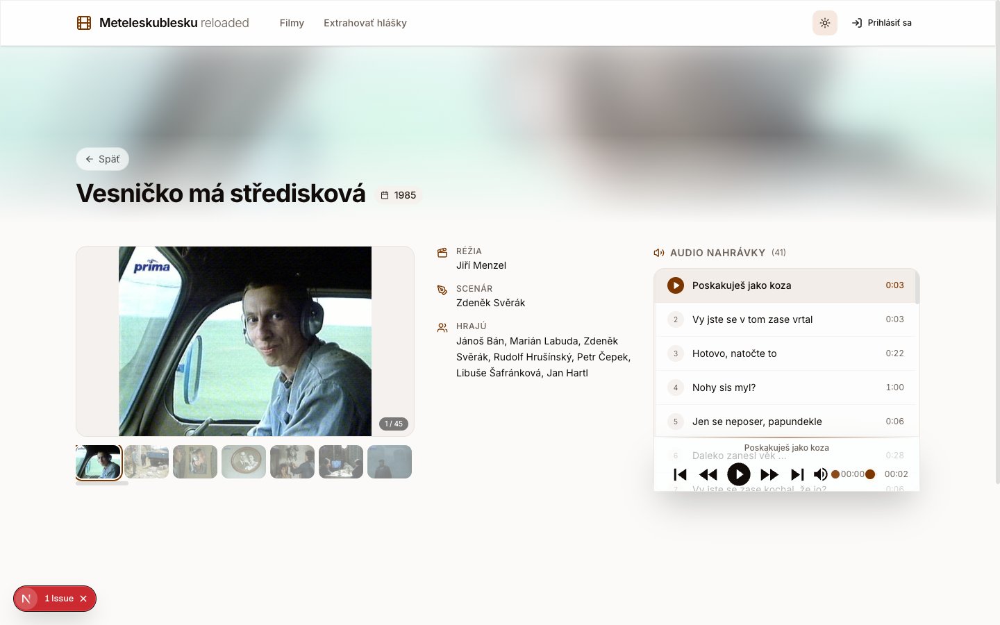
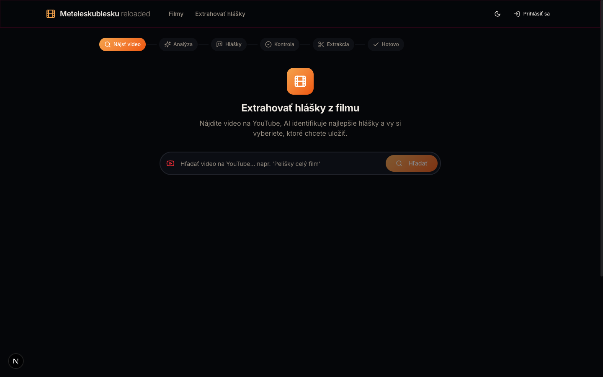

# MeteleskuBlesku

Kultova stranka meteleskublesku.cz potrebovala novy dizajn a hlavne potrebovala sfunkcnit. Vznikol tak novy frontend stranky, ktory je zalozeny na Next.js. Povodne to bol jednoduchy proxy/cache frontend, ale medzicasom sa z toho stal plnohodnotny system na spravu filmovych hlasky s AI extrakciou z YouTube.

## Project Description

A full-stack web application for browsing, extracting, and managing iconic Czech/Slovak movie quotes. Originally a caching proxy for meteleskublesku.cz, it has evolved into a standalone platform with AI-powered audio clip extraction from YouTube videos.

Key features:

- **Movie browsing** -- Search, filter, and browse films with audio player and image gallery
- **AI quote extraction** -- Paste a YouTube URL, fetch subtitles, let Google Gemini identify the best quotes, then extract audio clips with timestamps
- **Clip management** -- User dashboard for managing clips, sharing via unique hash links (public/private)
- **CSFD integration** -- Fetch film metadata (poster, cast, director, plot) from the Czech-Slovak Film Database
- **Authentication** -- GitHub OAuth and email/password credentials via NextAuth 5
- **Legacy scraper** -- Import content from the original meteleskublesku.cz website
- **Admin tools** -- Import legacy data, batch update images and durations

## Screenshots

<p align="center">
  
</p>

<p align="center">
  
</p>

<p align="center">
  
</p>

<p align="center">
  
</p>

## Tech Stack

| Layer | Technology |
|-------|-----------|
| Framework | Next.js 16 (App Router, Turbopack, Server Components) |
| UI | React 19, TypeScript 5.8 (strict) |
| Styling | Tailwind CSS 4, shadcn/ui (Radix primitives), Lucide icons |
| Database | SQLite + Prisma 7.5 (`@prisma/adapter-better-sqlite3`) |
| Auth | NextAuth 5 (JWT, GitHub OAuth + email/password) |
| AI | Google Gemini (`@google/genai`) for quote extraction from YouTube subtitles |
| Media | yt-dlp (`youtube-dl-exec`), fluent-ffmpeg, sharp |
| Film data | node-csfd-api for Czech-Slovak Film Database |
| Deployment | Docker + docker-compose |

## Project Structure

```
src/
  app/                    # App Router pages & layouts
    api/                  # 19 API route handlers
      admin/              #   import-legacy, update-images, update-durations
      auth/               #   [...nextauth], signup
      clips/              #   CRUD for user clips
      csfd/               #   CSFD film metadata lookup
      history/            #   video analysis history
      media/              #   audio & image proxy/cache
      movies/             #   movie list, detail, search
      youtube/            #   search, subtitles, analyze, extract, batch-extract
    movie/[id]/           # Movie detail page
    add/                  # Add new quote flow
    dashboard/            # User clip dashboard
    list/                 # Movie listing
    clip/                 # Shared clip view
    auth/                 # Sign-in / sign-up pages
  components/             # UI components (shadcn/ui + custom)
    ui/                   #   shadcn/ui primitives
    audio-player.tsx      #   Audio playback
    extraction-wizard.tsx #   Multi-step quote extraction
    movie-card.tsx        #   Movie grid card
    movie-search.tsx      #   Search & filter bar
    image-gallery.tsx     #   Image lightbox
    ...
  lib/                    # Core logic
    auth.ts               #   NextAuth configuration
    cache.ts              #   File-based media cache
    gemini.ts             #   Google Gemini AI client
    prisma.ts             #   Prisma client singleton
    scraper.ts            #   Legacy site scraper
    utils.ts              #   Shared utilities
  types/                  # TypeScript type definitions
  generated/prisma/       # Generated Prisma client
prisma/
  schema.prisma           # 8 models: User, Account, Session, VerificationToken,
                          #   UserClip, UserMovie, VideoHistory, ExtractionDraft
data/                     # SQLite database file
public/                   # Static assets
```

## API Endpoints

### Movies
- `GET /api/movies` -- List all movies
- `GET /api/movies/[id]` -- Movie detail by ID
- `GET /api/movies/search` -- Search movies

### YouTube / Extraction
- `GET /api/youtube/search` -- Search YouTube videos
- `POST /api/youtube/subtitles` -- Fetch subtitles for a video
- `POST /api/youtube/analyze` -- AI analysis of subtitles (Gemini)
- `POST /api/youtube/extract` -- Extract a single audio clip
- `POST /api/youtube/batch-extract` -- Extract multiple clips at once

### Clips
- `GET/POST/DELETE /api/clips` -- CRUD for user clips

### Media
- `GET /api/media/audio` -- Serve/cache audio files
- `GET /api/media/image` -- Serve/cache image files

### Auth
- `GET/POST /api/auth/[...nextauth]` -- NextAuth handlers
- `POST /api/auth/signup` -- Email/password registration

### Other
- `GET /api/csfd` -- CSFD film metadata lookup
- `GET/POST /api/history` -- Video analysis history
- `GET /api/history/[videoId]` -- History for a specific video
- `POST /api/admin/import-legacy` -- Import legacy site data
- `POST /api/admin/update-images` -- Batch update movie images
- `POST /api/admin/update-durations` -- Batch update clip durations

## Setup Instructions

1. **Clone the repository:**
   ```bash
   git clone <repository_url>
   cd meteleskublesku
   ```

2. **Install dependencies:**
   ```bash
   npm install
   ```

3. **Environment variables:**
   ```bash
   cp .env.example .env
   ```
   Edit `.env` and fill in the required values:

   | Variable | Description |
   |----------|-------------|
   | `NEXT_PUBLIC_OLD_URL` | Base URL of the original meteleskublesku.cz site |
   | `NEXT_PUBLIC_GA_MEASUREMENT_ID` | Google Analytics measurement ID |
   | `DATABASE_URL` | SQLite database path (e.g. `file:./data/meteleskublesku.db`) |
   | `AUTH_SECRET` | NextAuth secret -- generate with `openssl rand -base64 32` |
   | `AUTH_GITHUB_ID` | GitHub OAuth app client ID |
   | `AUTH_GITHUB_SECRET` | GitHub OAuth app client secret |
   | `AUTH_TRUST_HOST` | Set to `true` for non-Vercel deployments |
   | `GEMINI_API_KEY` | Google Gemini API key (required for AI quote extraction) |

4. **Set up the database:**
   ```bash
   npm run db:generate
   npm run db:push
   ```

5. **External dependencies:**
   - `yt-dlp` must be installed on the system for YouTube audio extraction
   - `ffmpeg` must be installed for audio processing

## Running Locally

```bash
npm run dev
```

Starts the Next.js dev server with Turbopack on `http://localhost:3781`.

## Available Scripts

| Script | Description |
|--------|-------------|
| `npm run dev` | Development server (Turbopack, port 3781) |
| `npm run build` | Production build |
| `npm run start` | Start production server |
| `npm run lint` | ESLint |
| `npm run db:generate` | Generate Prisma client |
| `npm run db:push` | Push schema to database |
| `npm run db:studio` | Open Prisma Studio |

## Docker Deployment

```bash
docker-compose up --build
```

The `Dockerfile` and `docker-compose.yml` handle the full build and deployment. Make sure your `.env` file is configured before building.
